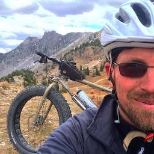

# Quantifying the effect of Wind Patterns on Air Quality.

The Salt Lake Valley has only two official EPA monitoring sites. All "official" air-quality based decisions use data from these two sites. However, air quality in the valley is highly spatial variant. One of the main sources of this variability is the wind. In this module we will explore the relationship between wind patterns and geography and how wind affects air quality. 

## Learning objectives

In this module we will

- Evaluate data from different sensor types.
- Use an api service to access data in real time and retrospectively.
- Visualize air quality data relative to wind conditions.
#### Introduction
1. Who are we?
    - http://meso1.chpc.utah.edu/mesowest_overview/
2. Introduction to api services:
    - What are the MesoWest/SynopticLabs api services?
        - https://synopticlabs.org/api/
    - How do you find out where particulate concentrations are measured in Utah?  
        - https://api.synopticlabs.org/v2/stations/latest?&token=demotoken&state=UT&vars=PM_25_concentration
        - http://meso2.chpc.utah.edu/aq/
3. Learning objectives:

We will use Python to view air quality data from the MesoWest API.

## Authors

<table width="500" border="0" cellpadding="5">

<tr>

<td align="center" valign="center">

 
John Horel
</td>

<td align="center" valign="center">

 
Brian Blaylock
</td>
<td align="center" valign="center">

 
Brian Chapman
</td>
</tr>

</table>
